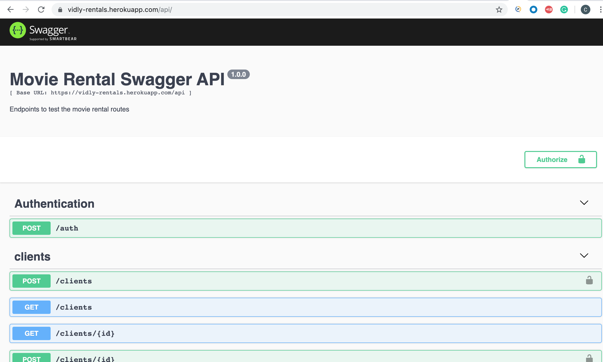

# Movie Rental - App
This is a backend application that exposes routes for a movie rental business

# Table of Contents

- [Getting Started](#getting-started)
- [Technology Stack](#technology-stack)
- [Installation](#installation)
- [Documentation](#documentation)
- [Testing](#testing)
- [Support or Contribution](#support-or-contribution)

## Getting Started
This is a server-side javascript application built [Express JS](https://expressjs.com/) application. The database is [MongoDB](https://www.mongodb.com/)

## Technology Stack

**Server Side**
1. ExpressJs
2. MongoDB

## Installation

1. Install [**Node JS**](https://nodejs.org/en/)
2. Install [Git](https://git-scm.com/downloads)
3. Install [Mongo Database](https://docs.mongodb.com/compass/master/install/)
4. Set up [Mongod](https://www.codecademy.com/articles/tdd-setup-mongodb-2)

2. Clone the [**repository here**](https://github.com/syntiara/Movie-Rentals-API.git)
3. [**cd**] into the root of the **project directory**.
4. Run `npm run install` on the terminal to install project dependecies
5. Create an env file in the root folder and define variables from env-sample
6. Run `$ npm run start:dev` to start the application

## Documentation

I have implemented swagger for proper code documentation, using [swagger-ui-express](https://www.npmjs.com/package/swagger-ui-express) and [swagger-jsdoc](https://www.npmjs.com/package/swagger-jsdoc)

You can launch this with `npm run start:dev`

Navigate to `http://localhost:50300/api` on your preferred browser

## Testing

Server side tests - Run `npm test` on the terminal while within the **project root directory**.

server side testing is achieved through the use of `jest` package. `jest` is a testing framework, used to test javascript code.

## Support or Contribution
For any suggestions or contributions or issues please do raise them or email me.
For **Contributiions**, Please clone the repo and implement a PR I would appreciate it
